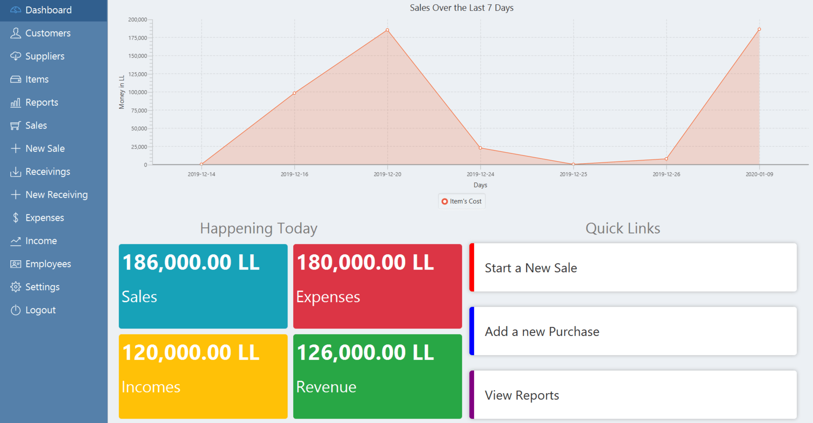
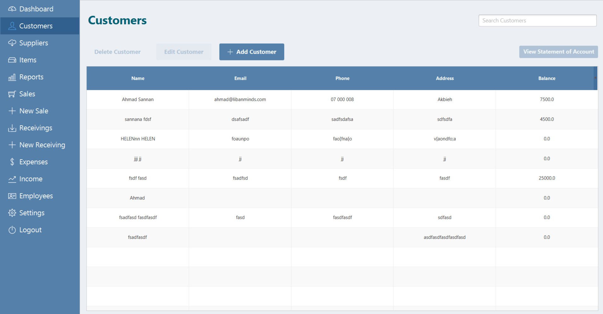
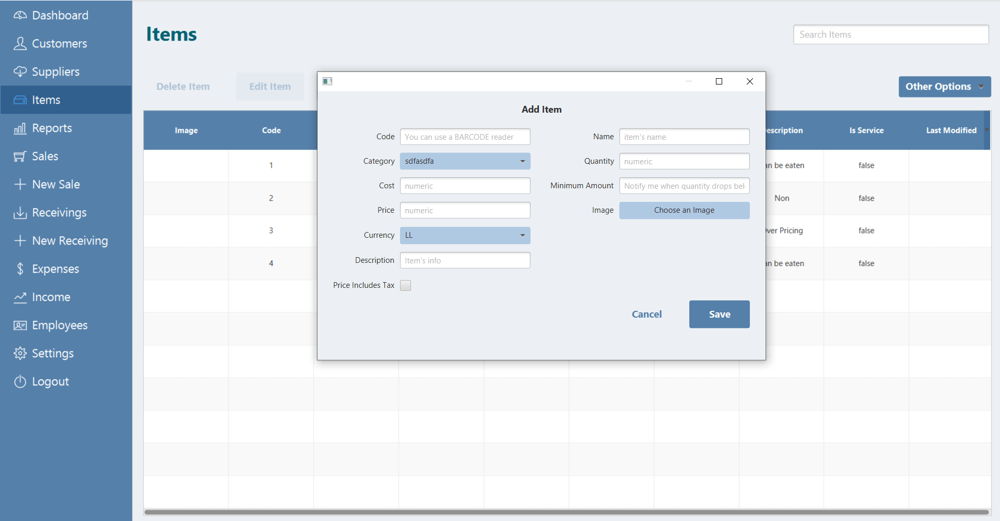
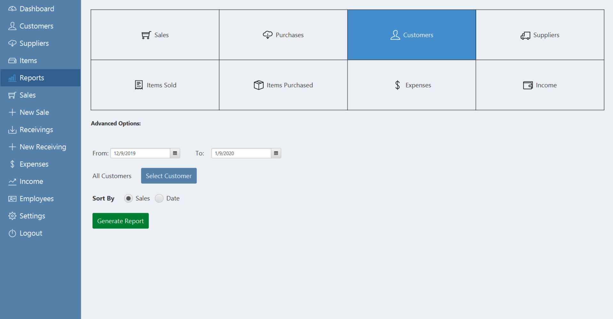
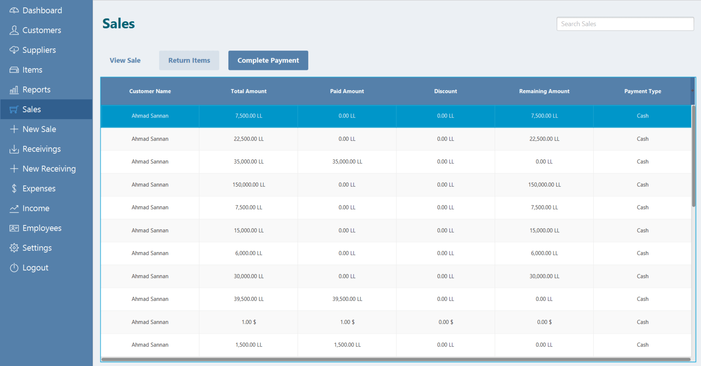
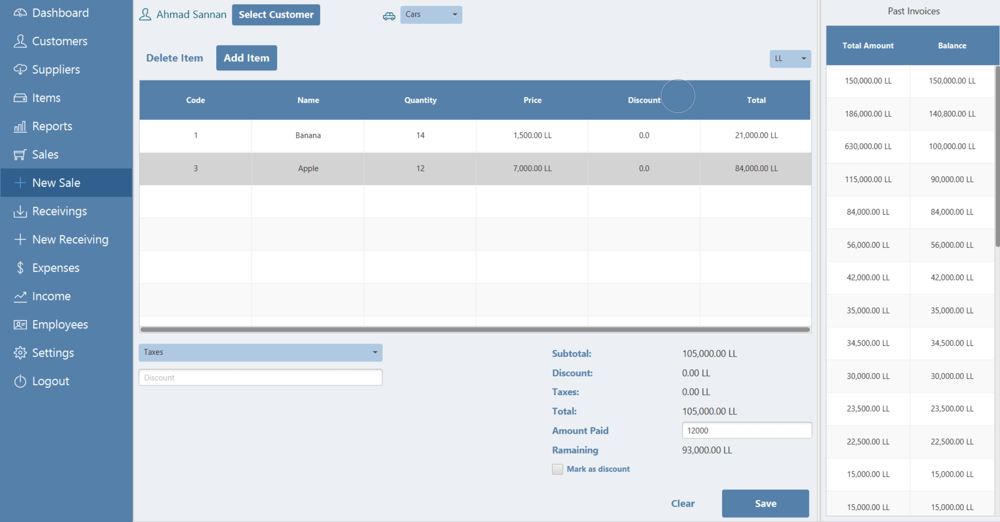
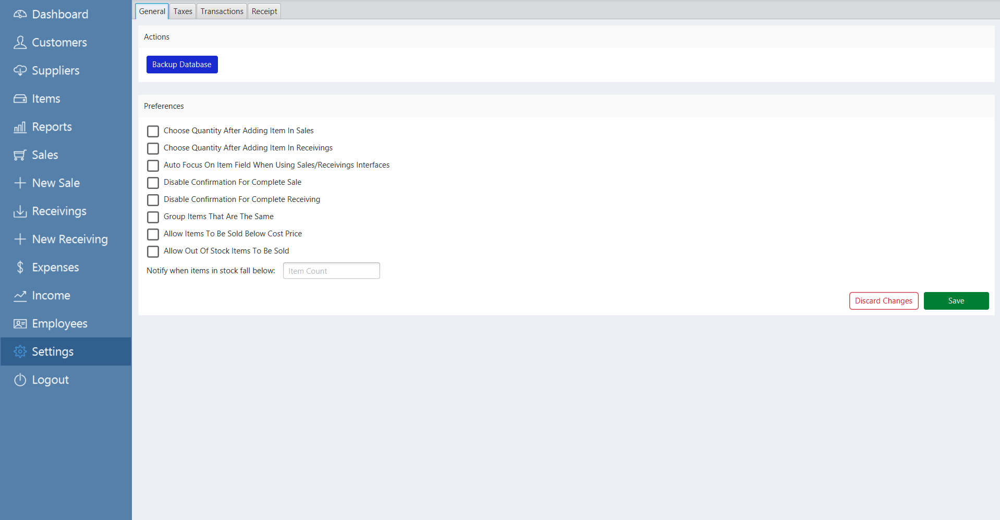

# POS System

Built using JavaFX

## Note

The POS is not yet fully tested and does contain many bugs. We stopped working on it due to time constraints, so we decided to make it an open source project.

## Development

Please check the following link for the environment configuration: [link](https://openjfx.io/openjfx-docs/)

## Screenshots

Below are some demo images from the project:

